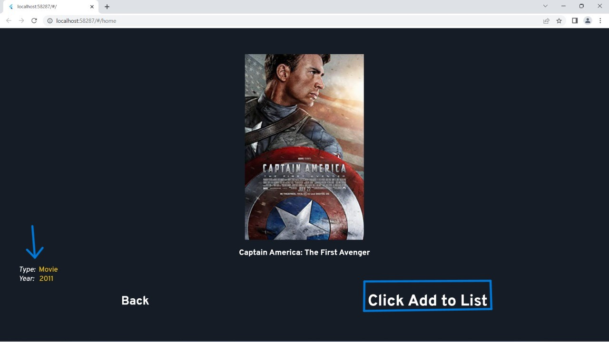

# Wolkus-Assignment-WebApp

## Getting Started
 

- [Github Pages](https://github.com/Ashutoshmishra88/Wolkus-project-movie)
- [Web app link](https://ashutoshmishra88.github.io/Wolkus-project-movie/)
 

 ## Instruction to used the flutter code :
 
 
 git  clone https://github.com/Ashutoshmishra88/Wolkus-project-movie.git
 
 cd Wolkus_Assignment
 
 code ...
 
 flutter run --no-sound-null-safety
 

# Data Analytics Charts
 

